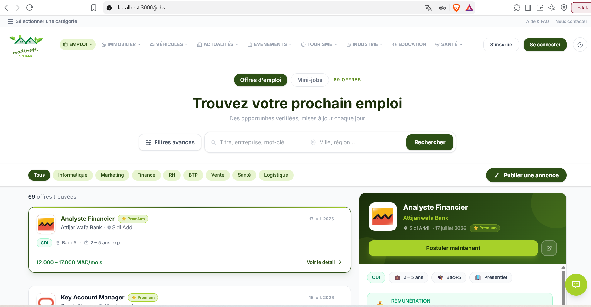
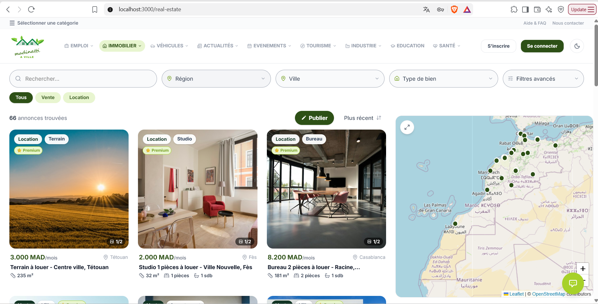
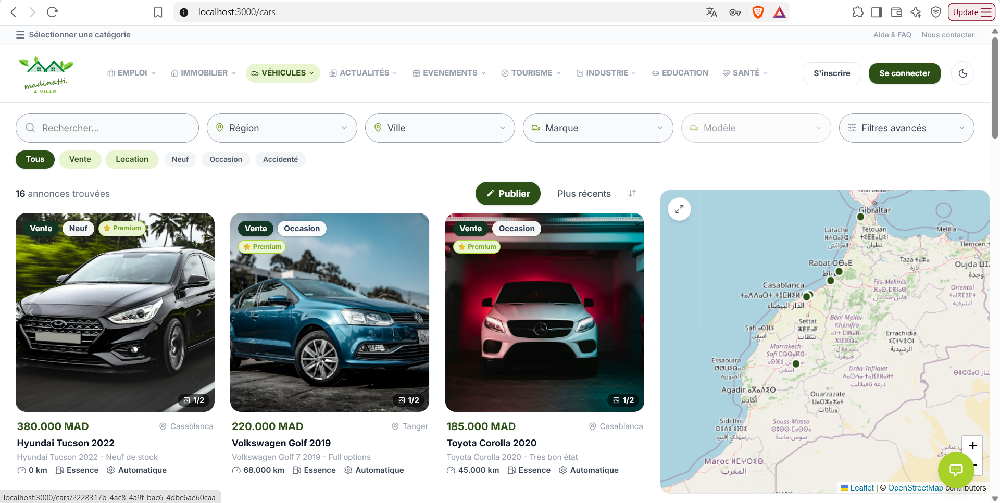

# Madinatti


## Screenshots

| Home | Jobs |
|---|---|
|  |  |

| Real estate | Cars |
|---|---|
|  |  | 

## Installation
Madinatti is a local platform that brings everyday city services into one place. Users can find jobs, real estate, cars, health services (pharmacies, clinics, labs), events and more, while businesses and recruiters can publish listings and manage applications.

> 🇫🇷 Plateforme locale multi-services avec frontend Next.js, backend Express, PostgreSQL et Prisma 6.


## Features

- **Jobs and recruitment:** job offers, applications, candidate profiles, CV upload and download, headhunter tools
- **Real estate:** sale and rent listings with filters, admin moderation
- **Cars:** vehicle listings and catalog
- **Health:** pharmacies, clinics, laboratories, doctors, dentists and more, combining local listings with Google Places data on a map
- **Events and media:** event listings, image viewer, analytics
- **Education, shops and tourism** modules
- **Authentication:** email/password and Google sign-in, password reset, token versioning, rate limiting
- **Admin and moderation:** listings are reviewed before going live

## Tech stack

| Layer | Technologies |
|---|---|
| Frontend | Next.js, React, CSS |
| Backend | Node.js, Express |
| Database | PostgreSQL, Prisma 6 |
| Services | Google Maps and Places API, Cloudinary |
| Testing | Automated tests for auth and CV security |
| Deployment | Vercel, GitHub Actions |

## Team

Built by a team of three:

- [@MouhyiDS](https://github.com/MouhyiDS)
- [@elmahdiaarich](https://github.com/elmahdiaarich)
- [@Aymaneeeeeee](https://github.com/Aymaneeeeeee)

**My contributions:** [Write 3 or 4 bullets about what you built, e.g. the health module, the deployment workflow, parts of the authentication system.]

## Getting started

### 1. Install dependencies

```bash
npm install
npm install --prefix frontend
npm install --prefix backend
```

### 2. Configure environment variables

Copy the example files and fill in **your own** values.

Windows (PowerShell or cmd):

```bash
copy .env.example .env.local
copy backend\.env.example backend\.env
copy frontend\.env.example frontend\.env.local
```

macOS / Linux:

```bash
cp .env.example .env.local
cp backend/.env.example backend/.env
cp frontend/.env.example frontend/.env.local
```

### 3. Set up the database

```bash
cd backend
npx prisma migrate dev
npx prisma generate
npm run seed
```

On Windows, use `npx.cmd` if `npx` is blocked by PowerShell. In production, use `prisma migrate deploy`.

### 4. Run the project

```bash
npm run dev
```

- Frontend: http://localhost:3000
- Backend: http://localhost:5000

### Other commands

```bash
npm run build --prefix frontend
npm run lint --prefix frontend
npm run seed --prefix backend
```

## Health module

The `/sante` page shows seven subcategories:

`pharmacy`, `hospital-clinic`, `medical-laboratory`, `doctor-office`, `dentist`, `radiology-center`, `parapharmacy`

API endpoints:

| Method | Route | Description |
|---|---|---|
| GET | `/api/health/subcategories` | List subcategories |
| GET | `/api/health/places` | List places |
| GET | `/api/health/places/:id` | Place details |
| POST | `/api/health/places` | Create a place |
| PUT | `/api/health/places/:id` | Update a place |
| POST | `/api/health/places/:id/claim` | Claim a listing |
| PATCH | `/api/health/places/:id/moderate` | Approve or reject (admin) |

Results combine approved local listings with Google Places API (New) when a server key is configured. Google data is fetched on demand with minimal field masks, a timeout, short caching, a limited search radius, and deduplication by `googlePlaceId`.

## Google Cloud setup

Enable billing and these APIs:

- **Maps JavaScript API** for the browser map
- **Places API (New)** for Nearby Search, Text Search and Place Details on the backend

Recommended key restrictions:

- `GOOGLE_MAPS_SERVER_API_KEY`: restrict by server IP and to Places API (New). Never expose it to the frontend or in a `NEXT_PUBLIC_*` variable.
- `NEXT_PUBLIC_GOOGLE_MAPS_BROWSER_KEY`: restrict by HTTP referrer (localhost and your production domains) and to Maps JavaScript API.
- Set quotas, budgets and billing alerts.

Nearby Search is limited by radius and does not return an exhaustive list. Search is dynamic around the user's GPS position, a city, or the map center.

## Security

- Never commit real secrets. Keep them in `.env` files, which are git-ignored.
- Never put `GOOGLE_CLIENT_SECRET` or any server key in a `NEXT_PUBLIC_*` variable.
- Do not log API keys.
- Revoke and rotate any key that has ever been shared or committed.
